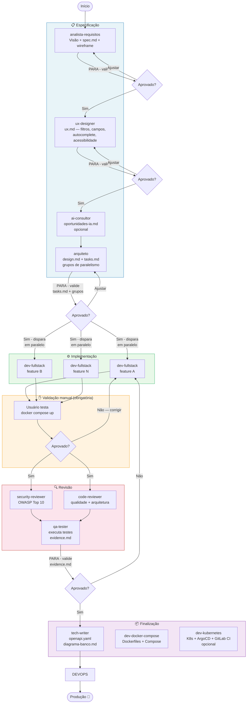

# Guia de Uso — Time de Agentes

> Versão 1.0 — Julho 2026  
> Novo no template? Leia este arquivo do início ao fim.  
> Retornando? Vá direto para "Sessões de continuidade".

---

## O que é este template

Um conjunto de **15 agentes e 11 skills** para Claude Code que transforma
o desenvolvimento em um fluxo estruturado. Você atua como dono do produto;
o time de agentes cuida do resto.

**Princípio central:** cada agente tem uma função única. As regras
universais ficam em `CLAUDE.md`. As convenções de tecnologia ficam nas
skills. Os agentes são pontes entre os dois — leem os documentos certos
e entregam o artefato correto.

**Stacks suportadas nativamente:**
- Backend: Go + Gin | Python + FastAPI | Java + Spring Boot | PHP + Laravel
- Frontend: Next.js + shadcn/ui | Angular (+ DSGOV para sistemas públicos)
- Banco: PostgreSQL | Infra: Docker + Kubernetes

---

## Princípios de comportamento dos agentes

Os agentes seguem 4 princípios definidos no `CLAUDE.md` (derivados das
observações de Andrej Karpathy sobre armadilhas de LLMs em código):

| Princípio | O que previne |
|---|---|
| **Pensar antes de codificar** | Premissas silenciosas, confusão escondida, tradeoffs perdidos |
| **Simplicidade primeiro** | Overengineering, abstrações desnecessárias, features especulativas |
| **Mudanças cirúrgicas** | Refatorações não pedidas, alterações colaterais, limpeza indevida |
| **Execução orientada a objetivos** | Critérios vagos que exigem clarificação constante |

**O princípio mais impactante para o fluxo do projeto é o Goal-Driven:**
em vez de dizer "implemente X", os agentes transformam cada task em um
critério verificável ("o teste Y deve passar com os dados Z") e iteram
de forma autônoma até atingi-lo — mínima interação.

Você pode induzir esse comportamento explicitamente com comandos como:
> "Implemente a feature de processos. O objetivo é que todos os cenários
> Given/When/Then de specs/processos/spec.md passem nos testes."

O `/goal` no Claude Code funciona exatamente assim: define o critério
de sucesso e deixa o agente iterar até concluir sem interrupções.

---

## Diagrama do fluxo de uso



---

## Fluxo de uso — do zero à funcionalidade rodando

### Passo 0 — Preparar o ambiente

```bash
cd meu-projeto && claude
```

**Opcional — configurar o ambiente de desenvolvimento antes da primeira spec:**
> "Use o dev-docker-compose para configurar o ambiente de desenvolvimento"

Cria Dockerfiles (produção e dev com volume + hot-reload), docker-compose,
`.gitignore`, `.env.example` e `sonar-project.properties`. Pode ser feito
antes mesmo de qualquer especificação.

---

### Passo 1 — Visão do projeto (uma única vez)

> "Use o analista-requisitos"

Em projeto novo, ele pergunta objetivo, atores, funcionalidades iniciais,
stack e restrições. Cria dois arquivos e **para**:
- `specs/00-visao-produto.md`
- `project.config.md` (todos os agentes leem este arquivo)

✅ **Valide os dois arquivos antes de continuar.**

---

### Passo 2 — Especificar uma funcionalidade

> "Use o analista-requisitos"

Descreva a funcionalidade em linguagem natural. O analista cria
`specs/<feature>/spec.md` com critérios Given/When/Then, exemplos
concretos com dados reais (não "Teste 123") e proposta de testes,
depois **para**.

✅ **Valide o spec.md.**

---

### Passo 3 — UX (se a feature tiver tela)

> "Use o ux-designer para essa funcionalidade"

Define filtros, colunas do grid, ordenação padrão, campos de autocomplete,
4 estados de tela (loading/erro/vazio/dados), pontos de acessibilidade e
estrutura do menu hierárquico (na primeira feature). Para e aguarda.

✅ **Valide o ux.md.**

---

### Passo 4 — IA (opcional)

> "Use o ai-consultor para essa funcionalidade"

Sugere onde IA agrega valor com estimativa de valor, complexidade e risco.
Você aprova/rejeita/adia cada sugestão. O consultor para e aguarda.

---

### Passo 5 — Design técnico

> "Use o arquiteto para essa funcionalidade"

Gera `specs/<feature>/design.md` com diagrama Mermaid e `tasks.md`,
depois **para**. Este é o ponto mais importante do ciclo.

✅ **Valide design.md e tasks.md. Ao confirmar, o arquiteto dispara o time.**

---

### Passo 6 — Implementação

`dev-fullstack` é o único desenvolvedor — agnóstico de tecnologia.
O arquiteto dispara vários em paralelo para features independentes:

```
feature-A → dev-fullstack  ─┐
feature-B → dev-fullstack  ─┤── em paralelo real, sem dependência entre si
feature-C → dev-fullstack  ─┘
```

Cada `dev-fullstack` valida scripts com o `dba`, escreve testes unitários
(TDD) e E2E, e entrega o código pronto para receber auth/authz/auditoria.
Ao terminar, **para e aguarda sua validação** — nunca aciona revisão sozinho.

---

### Passo 6.5 — Consolidação de migrations + validação manual

Antes de qualquer revisão, **dois passos obrigatórios**:

1. **`dba` consolida as migrations** — N arquivos incrementais viram 1 limpo
2. **Você testa** no ambiente de desenvolvimento:
   ```bash
   docker compose -f docker-compose.yaml -f docker-compose.dev.yml up
   ```

Depois diga:
- **"Aprovado"** → o arquiteto aciona a revisão
- **"Tem problemas: X"** → o `dev-fullstack` corrige, você testa de novo

> A consolidação garante que os reviewers leem código limpo, não histórico de dev.

---

### Passo 7 — Revisão e validação (só após "Aprovado")

```
security-reviewer + code-reviewer  ─── em paralelo
               ↓
qa-tester → evidence.md
               ↓ PARE ✅ aprovação final é sua
               ↓
tech-writer → dev-docker-compose
```

---

### Passo 8 — Fase Release (ao declarar versão estável)

> "Declaramos a versão 1.0"

O arquiteto coordena:
1. `VERSION` atualizado na raiz: `echo "1.0.0" > VERSION`
2. `dba` gera `specs/releases/v1.0/release.sql` (UP + DOWN num arquivo único)
3. `tech-writer` congela `specs/releases/v1.0/openapi.yaml` + `CHANGELOG.md`
4. `dev-fullstack` confirma endpoint `/version` e página `/sobre` atualizados
5. `specs/_status.md` registra versão como "lançada"

```
specs/releases/v1.0/
  release.sql   ← schema completo (-- UP) + rollback (-- DOWN) num arquivo
  openapi.yaml  ← contrato da API congelado
  CHANGELOG.md  ← o que foi entregue
```

---

### Passo 9 — Rodar

```bash
# Desenvolvimento
docker compose -f docker-compose.yaml -f docker-compose.dev.yml up

# Produção / CI
docker compose -f docker-compose.yaml up --build
```

---

## Sessões de continuidade

Sempre comece com:
> "Use o analista-requisitos"

Ele lê `specs/_status.md` e apresenta o estado atual. Nunca precisa
reexplicar o projeto em uma sessão nova.

---

## Fluxo de autenticação e autorização ABAC

Fluxo separado e deliberado — após as features principais funcionarem.

> "Arquiteto, vamos adicionar autenticação. A rota \<X\> exige perfil \<Y\>.
> \<Restrições de contexto, se houver\>"

O arquiteto define a estratégia JWT + ABAC e chama `dev-auth`.
O modelo adotado combina perfil + permissão + atributos de ambiente
(horário, localidade — sempre do servidor, nunca do cliente).
Ver `CLAUDE.md` seção "Autenticação e autorização" para o modelo completo.

---

## Deploy em Kubernetes com ArgoCD (opcional)

Esta seção é para projetos que fazem deploy em Kubernetes. É um fluxo
**separado e opcional** — não faz parte do ciclo de desenvolvimento padrão.

> "Use o dev-kubernetes para gerar os manifests Kubernetes e o pipeline GitLab CI/CD"

### Modelo GitOps adotado

O modelo é **GitOps com ArgoCD central** — a diferença fundamental em
relação ao deploy tradicional:

```
❌ Modelo tradicional (runner aplica no cluster):
   GitLab Runner → kubectl apply → Kubernetes
   Problema: runner precisa acessar a API do K8s (problema de rede)

✅ Modelo GitOps (ArgoCD puxa do Git):
   GitLab Runner → atualiza tag no Git → commit
   ArgoCD (dentro do cluster) → detecta mudança → aplica
   Vantagem: runner nunca toca no cluster, K8s alcança o Git (saída)
```

### Ambientes e clusters

O projeto usa **ArgoCD central** que gerencia múltiplos clusters:

| Ambiente | Cluster | Sincronização |
|---|---|---|
| `dev` (padrão) | Cluster de desenvolvimento | **Automática** — ArgoCD sincroniza ao detectar novo commit |
| `staging` (padrão) | Cluster de staging | **Automática** |
| `prod` (padrão) | Cluster de produção (isolado) | **Manual** — requer ação no GitLab E no ArgoCD |

Os nomes dos ambientes (`dev`, `staging`, `prod`) são defaults
parametrizáveis via variáveis de ambiente no GitLab.

### Pipeline GitLab CI/CD (9 fases)

```
lint → test → sonarqube → build → security → push → deploy-dev → deploy-staging → deploy-prod
```

As fases de deploy não rodam `kubectl apply` — elas atualizam a tag da
imagem no arquivo `deploy/k8s/overlays/<env>/image.yaml` via commit Git.
O ArgoCD detecta o commit e sincroniza o cluster correspondente.

### Variáveis obrigatórias no GitLab

Configurar em **Settings → CI/CD → Variables** (nunca no repositório):
- `REGISTRY_URL`, `REGISTRY_USER`, `REGISTRY_TOKEN` — Harbor privado
- `ARGOCD_SERVER`, `ARGOCD_TOKEN` — ArgoCD central
- `SONAR_HOST_URL`, `SONAR_TOKEN` — SonarQube

### Migração NGINX → Traefik

Quando migrar o Ingress controller, apenas altere uma anotação em
`deploy/k8s/base/ingress.yaml` — o Kustomize propaga para todos os
overlays automaticamente. O `dev-kubernetes` já gera o arquivo com
comentário indicando onde fazer a troca.

---

## Ajuste vs. funcionalidade nova

| Situação | Como tratar |
|---|---|
| Detalhe de UI ou comportamento já definido em spec | Fale direto: "dev-fullstack, ajusta X" |
| Muda ou adiciona critério de aceite | Nova spec → volta ao Passo 2 |
| Nova funcionalidade | Volta ao Passo 2 |

---

## Hierarquia de autoridade

Quando dois agentes discordarem, esta cadeia define quem tem a palavra final:

```
Dono do produto        ← aprovação final sempre humana
analista-requisitos    ← o que o sistema faz  (spec.md é a lei)
arquiteto              ← como é construído     (design.md é a lei)
dba                    ← como o banco suporta  (schema final)
dev-fullstack          ← como é implementado   (segue design.md + skills)
qa-tester              ← reporta resultado, não decide
```

**Regra prática:** agente em desacordo registra a discordância com
justificativa e devolve para o agente de autoridade — nunca entra em loop,
nunca implementa diferente do que foi decidido sem aprovação explícita.
Ver `CLAUDE.md` seção "Hierarquia de autoridade" para o protocolo completo.

---

## Referência: os 15 agentes

### Descoberta e especificação

| Agente | Função | Entrega |
|---|---|---|
| `analista-requisitos` | Ponto de entrada obrigatório de qualquer sessão | `specs/00-visao-produto.md` + `project.config.md` (projeto novo) ou `specs/<feature>/spec.md` |
| `ux-designer` | Projeta fluxo, estados e acessibilidade | `specs/<feature>/ux.md` |
| `ai-consultor` | Sugere oportunidades de IA | `specs/<feature>/oportunidades-ia.md` |
| `arquiteto` | Design técnico e coordenação do time | `specs/<feature>/design.md` + `tasks.md` |

### Implementação

| Agente | Função | Entrega |
|---|---|---|
| `dev-fullstack` | **Único desenvolvedor** — qualquer stack, com ou sem UI. Valida scripts com dba. Escreve testes unitários e E2E | Código completo: migration → use case → handler → UI → testes |
| `dba` | Parceiro técnico: valida migrations e queries complexas antes de executar; cria schema quando tasks.md indicar | Validação + migration up/down + seed + índices + diagrama ER |
| `dev-ia` | Implementa oportunidades de IA aprovadas | Integração LLM com interface em `/port` |
| `dev-auth` | Fluxo de auth JWT + engine ABAC (após features funcionando) | Middleware de autenticação + engine de políticas |
| `dev-auditoria` | Sistema de auditoria duplo | Tabela `auditoria` + adapter dual-channel (banco + syslog) |
| `dev-mcp` | **Serviço acessório** — cria servidor MCP que expõe a API da aplicação como tools para LLMs. Acionado pelo usuário quando julgar necessário, fora do fluxo padrão | Servidor MCP em `mcp/` com Dockerfiles, configuração de cliente e `docs/mcp.md` |
| `dev-docker-compose` | Ambiente de desenvolvimento local | Dockerfiles dev+prod, docker-compose, .gitignore, .env.example, SonarQube config |
| `dev-kubernetes` | **Opcional** — deploy em Kubernetes | Manifests Kustomize, ApplicationSet ArgoCD central multi-cluster, .gitlab-ci.yml GitOps |

### Qualidade e validação

| Agente | Função | Entrega |
|---|---|---|
| `security-reviewer` | Revisão OWASP Top 10:2025 (em paralelo ao code-reviewer) | Achados em `evidence.md` — pode bloquear, não decide a solução |
| `code-reviewer` | Revisão de qualidade e arquitetura (em paralelo ao security-reviewer) | Achados em `evidence.md` |
| `qa-tester` | Executa os testes escritos pelo dev-fullstack, reporta resultado | `evidence.md` completo; chama dev-fullstack para corrigir falhas |
| `auditor-projeto` | Auditoria de conformidade | Verifica projeto existente contra padrões atuais — gera relatório com achados por severidade e plano de atualização |
| `load-tester` | Teste de carga k6 (quando design.md indicar) | Relatório com thresholds objetivos |
| `tech-writer` | Exporta OpenAPI e mantém diagrama ER consolidado | `docs/openapi.yaml` + `docs/diagrama-banco.md` + `CHANGELOG.md` |

---

## Referência: as 11 skills

Skills são lidas pelos agentes antes de implementar. Contêm as convenções
específicas de cada tecnologia — nunca as regras universais (essas ficam
em `CLAUDE.md`).

| Skill | Tecnologia | O que cobre |
|---|---|---|
| `backend-go` | Go + Gin | Hexagonal, sqlx, air (hot-reload), swaggo (OpenAPI), Prometheus |
| `backend-nestjs` | NestJS + Node.js | Hexagonal com módulos NestJS, class-validator, guards JWT, interceptors, @nestjs/swagger, Prometheus, /version |
| `backend-python-fastapi` | Python + FastAPI | Depends (DI), dataclass frozen (Value Objects), SQLAlchemy Core, Alembic, OpenAPI nativo |
| `backend-java-springboot` | Java + Spring Boot | DI via construtor, Records (Value Objects), Springdoc, Actuator/Micrometer |
| `backend-php-laravel` | PHP + Laravel | Service Container (DI), readonly class (Value Objects), Query Builder, l5-swagger |
| `frontend-nextjs-shadcn` | Next.js + shadcn/ui | App Router, hook de grid com localStorage, autocomplete com criação inline, AppShell |
| `frontend-angular` | Angular | Standalone Components, Signals, Material ou DSGOV, accordion hierárquico |
| `frontend-angular-dsgov` | Angular + DSGOV | Design System do Governo Federal, componentes `@govbr-ds/core`, eMAG |
| `accessibility` | — | WCAG 2.2 AA + WAI-ARIA — regras práticas por categoria, integração com Radix e CDK |
| `ai-anthropic` | Anthropic Claude | Formato de chamada, tool use para saída estruturada, tratamento de rate limit |
| `e2e-playwright` | Playwright | Estrutura de testes, seletores por acessibilidade, estados assíncronos |
| `load-testing-k6` | k6 | Scripts com thresholds, execução via Docker, envio para Prometheus |
| `mcp-server` | TypeScript / Python | Servidor MCP: estrutura de projeto, SDK, transporte STDIO/SSE, autenticação, Dockerfiles |
| `systematic-debugging` | Qualquer stack | Debug em 4 fases: reprodução → causa raiz → hipótese → correção. Baseado no Superpowers (Jesse Vincent) |
| `geo` | PostGIS + Leaflet + GeoServer | Dados geográficos: tipos PostGIS, SIRGAS 2000 (EPSG:4674), API GeoJSON, Leaflet, GeoServer WMS/WFS opcional, fontes IBGE/CONCAR. Ativado via `Geo: sim` em `project.config.md` |

### Documentação de referência (`.claude/references/`)

Arquivos de documentação técnica para uso direto pelos agentes, com fallback
quando o repositório oficial estiver indisponível:

| Arquivo | Conteúdo | Atualizar |
|---|---|---|
| `dsgov-llms-full.txt` | Documentação completa DSGOV WBC otimizada para IA | `curl -o .claude/references/dsgov-llms-full.txt https://webcomponents-ds.estaleiro.serpro.gov.br/llms-full.txt` |

Ver `.claude/references/README.md` para política de atualização.

---

### Skills externas opcionais (instalação separada)

**Caveman** — reduz ~65% dos tokens de output das respostas conversacionais, mantendo precisão técnica. Útil em sessões longas com muito diálogo. *Não recomendado para outputs que serão lidos por humanos (spec.md, design.md, código) — esses precisam de clareza.*
```bash
npx skills add JuliusBrussee/caveman
# Ativar na sessão: /caveman  |  Desativar: "stop caveman"
```

**Graphify** — transforma uma pasta de código, schemas SQL, docs e PDFs em um knowledge graph consultável. Útil para o `auditor-projeto` entender projetos legados, ou para o `arquiteto` mapear um sistema existente antes de propor mudanças. *Não faz parte do fluxo padrão de desenvolvimento.*
```bash
# Instalação
uv tool install graphifyy   # ou: pipx install graphifyy

# Registrar no Claude Code (uma vez)
graphify install

# Uso dentro do Claude Code
/graphify .                            # mapear o projeto atual
/graphify query "o que conecta auth ao banco?"
graphify export callflow-html          # diagrama de arquitetura em HTML com Mermaid
```
O graphify gera três arquivos em `graphify-out/`:
- `graph.html` — visualização interativa (abrir no browser)
- `GRAPH_REPORT.md` — nós centrais, conexões surpresa, perguntas sugeridas
- `graph.json` — grafo completo queryável

Repositório: https://github.com/safishamsi/graphify

---

## Como atualizar para uma nova versão do template

### 1. Backup antes de tudo

```bash
cp -r .claude .claude.bak
cp CLAUDE.md CLAUDE.md.bak
```

### 2. Extraia o novo template em pasta temporária

```bash
unzip ~/Downloads/template-sdd.zip -d /tmp/
```

### 3. Verifique customizações nas skills (passo crítico)

Se o arquiteto criou uma skill nova ou você editou alguma skill existente
durante o projeto, essas mudanças seriam perdidas. Compare antes:

```bash
diff -r /tmp/template-sdd/.claude/skills/ ./.claude/skills/
```

Para cada diferença: se foi uma customização intencional, faça merge
manual em vez de sobrescrever o arquivo todo.

### 4. Substitua agents e skills

```bash
# Agents: substituição total (sem customizações esperadas)
rm -rf .claude/agents/
cp -r /tmp/template-sdd/.claude/agents/ .claude/

# Skills: substitua os arquivos que NÃO foram customizados
# Para os customizados: merge manual conforme Passo 3
```

### 5. Atualize o CLAUDE.md

```bash
diff /tmp/template-sdd/CLAUDE.md ./CLAUDE.md
```

Se você adicionou regras de negócio específicas do projeto, copie-as para
o novo arquivo antes de substituir:

```bash
cp /tmp/template-sdd/CLAUDE.md ./CLAUDE.md
# Adicione de volta o conteúdo específico do seu projeto
```

### 6. O que você NÃO substitui

| O que fica intacto | Por quê |
|---|---|
| `specs/` | Suas histórias, designs e evidências de teste |
| `project.config.md` | Já configurado com sua stack |
| `docker-compose*.yml` | Já ajustado para seu projeto |
| `Dockerfiles` | Já ajustados para seu ambiente |
| `backend/` e `frontend/` | O código da aplicação |
| `docs/` | Diagramas e OpenAPI gerados |
| `.env.example` | Variáveis específicas do projeto |

### 7. Teste após a atualização

```bash
cd /caminho/do-seu-projeto && claude
```

> "Use o analista-requisitos"

Se ele reconhecer o estado atual (lendo `specs/_status.md`) e apresentar
o resumo correto das funcionalidades, a atualização funcionou.

### 8. Limpeza (opcional)

```bash
rm -rf .claude.bak CLAUDE.md.bak
```

---

## Quando algo der errado

| Situação | O que fazer |
|---|---|
| Agente avançou sem minha validação | "Pare. Vou validar o que você gerou antes de continuar." |
| Dois agentes em loop sem acordo | Ver `CLAUDE.md` seção "Hierarquia de autoridade" — o agente de maior autoridade no domínio decide |
| Spec ambígua descoberta na implementação | dev-fullstack para e devolve ao analista-requisitos — nunca resolve por conta própria |
| Problema de segurança exige mudança arquitetural | security-reviewer descreve o problema, arquiteto decide a solução |
| Preciso mudar o spec depois do design criado | Atualize spec.md, informe o arquiteto para reavaliar design.md |
| Skill não existe para a tecnologia escolhida | "Use o arquiteto para criar a skill de \<tecnologia\>" |
| Erro de compilação / container não sobe | Descreva o erro e chame: `dev-docker-compose` (Docker/infra) ou `dev-fullstack` (código) ou `dba` (migration) |
| Quero iniciar o fluxo de autenticação | "Arquiteto, vamos adicionar autenticação. A rota \<X\> exige perfil \<Y\>. \<Restrições de contexto\>" |

---

## Gitflow recomendado para times com desenvolvedores humanos

> Esta seção é para times onde múltiplos desenvolvedores humanos trabalham
> no mesmo projeto. Se você é o único desenvolvedor, pode simplificar
> ainda mais.

### Por que não o GitFlow clássico

O GitFlow tradicional (com branches `develop`, `release`, `hotfix`) foi
criado para software empacotado com lançamentos mensais ou trimestrais.
Para uma aplicação web com pipeline de CI/CD automatizado e deploys
frequentes, ele cria overhead desnecessário e feature branches de longa
duração — principal causa de merge conflicts e atrasos.

O modelo adotado aqui é o **GitHub Flow**, mais simples e adequado ao
contexto, com convenções de nomenclatura que se integram com a estrutura
de `specs/` do projeto.

---

### Branches permanentes

| Branch | Propósito | Quem faz deploy |
|---|---|---|
| `main` | Código em produção — sempre estável e deployável | Pipeline automático ao merge |
| `staging` | Ambiente de homologação — validação antes da produção | Pipeline automático ao merge |

**Regra fundamental:** `main` é sagrado. Ninguém commita diretamente em
`main`. Todo código chega via Pull Request aprovado com CI verde.

---

### Branches de trabalho (curta duração — máximo 2-3 dias)

```
feature/<nome-da-feature>     → nova funcionalidade
fix/<descricao-do-bug>        → correção de bug em desenvolvimento
hotfix/<descricao>            → correção urgente em produção
release/v<X.Y>                → preparação de versão (só quando declarar release)
```

**Exemplos alinhados com a estrutura de specs/:**
```
feature/cadastro-usuario
feature/listagem-processos
fix/paginacao-grid-overflow
hotfix/csrf-token-invalido
release/v1.0
```

---

### Fluxo do dia a dia

```
1. Antes de começar: sincronize com main
   git checkout main
   git pull origin main
   git checkout -b feature/nome-da-feature

2. Desenvolva em commits pequenos e frequentes
   git add .
   git commit -m "feat: adicionar filtro por status na listagem de processos"
   # Commitar pelo menos uma vez por dia — nunca deixar branch local
   # sem push por mais de 1 dia

3. Abra Pull Request para staging (não para main)
   git push origin feature/nome-da-feature
   # Abrir PR: feature/nome-da-feature → staging

4. CI roda automaticamente no PR
   lint → test → sonarqube → build
   # PR só pode ser mergeado com CI verde + aprovação

5. Após aprovação e CI verde: merge em staging
   # Deploy automático em staging
   # qa-tester valida no ambiente de staging

6. Após validação em staging: PR de staging → main
   # Deploy automático em produção
   # Deletar a feature branch após merge
```

---

### Convenção de mensagens de commit

Seguir o padrão **Conventional Commits** — facilita geração automática de
CHANGELOG e identificação de breaking changes:

```
<tipo>(<escopo opcional>): <descrição curta no imperativo>

feat(processos): adicionar filtro por data de criação
fix(auth): corrigir expiração prematura do token JWT
docs(api): atualizar spec OpenAPI do endpoint de processos
test(processos): adicionar cenário de processo sem responsável
refactor(grid): extrair componente StatusBadge para shared/
chore(deps): atualizar dependências de segurança
```

| Tipo | Quando usar |
|---|---|
| `feat` | Nova funcionalidade |
| `fix` | Correção de bug |
| `hotfix` | Correção urgente em produção |
| `docs` | Atualização de documentação |
| `test` | Adição ou correção de teste |
| `refactor` | Refatoração sem mudança de comportamento |
| `chore` | Atualização de dependência, config, infra |
| `perf` | Melhoria de performance |

**`feat!:` ou `fix!:`** (com `!`) = breaking change — aciona avaliação de
nova versão de API pelo `tech-writer`.

---

### Hotfix em produção

Quando um bug crítico precisar de correção imediata em produção:

```bash
# Parte de main (não de staging, que pode ter features não lançadas)
git checkout main
git pull origin main
git checkout -b hotfix/descricao-do-problema

# Corrija e teste
git commit -m "hotfix: corrigir validação de CPF no cadastro"

# PR direto para main (bypassa staging, mas ainda exige CI verde + aprovação)
# Após merge em main: trazer também para staging
git checkout staging
git merge main
```

---

### Regras de Pull Request

- **Mínimo 1 aprovação** de outro desenvolvedor antes do merge
- **CI obrigatoriamente verde** (lint + test + SonarQube Quality Gate)
- **Branch atualizada com main** antes do merge (rebase ou merge de main na branch)
- **Descrição do PR referencia o spec:** "Implementa `specs/listagem-processos/`"
- **Feature branch deletada** imediatamente após o merge
- **Nunca fazer force push** em `main` ou `staging`

---

### Relação com o versionamento de releases

Quando o time decidir lançar uma versão:

```bash
# Criar branch de release a partir de staging
git checkout staging
git checkout -b release/v1.0

# dba consolida migrations
# tech-writer congela snapshot da API
# CHANGELOG atualizado

# Merge em main com tag de versão
git checkout main
git merge --no-ff release/v1.0
git tag -a v1.0 -m "Release v1.0"
git push origin main --tags

# Trazer tag de volta para staging
git checkout staging
git merge main
```

---

### Resumo visual

```
main      ←─────────────────── merge (após validação) ───── tag v1.0
             ↑                                           ↑
staging   ←─ merge feature/A ←─ merge feature/B ─────── release/v1.0
             ↑                   ↑
feature/A ──┘           feature/B ┘
(2 dias máx)            (2 dias máx)

hotfix/bug ─────────────────────────────────────────────→ main (direto)
                                                          ↓
                                                        staging (sync)
```

---

### Integração com os agentes de IA

Os agentes do time não commitem código — eles **geram arquivos** que o
desenvolvedor humano revisa e commita. O fluxo recomendado:

```
1. Abre a feature branch antes de chamar o dev-fullstack
   git checkout -b feature/nome-da-feature

2. Chama os agentes (analista → ux-designer → arquiteto → dev-fullstack)

3. Revisa o código gerado, testa localmente
   docker compose -f docker-compose.yaml -f docker-compose.dev.yml up

4. Commita o que foi validado
   git add .
   git commit -m "feat(processos): implementar listagem com filtro e paginação"

5. Abre PR para staging
```

Nunca commitar código gerado pelos agentes sem revisar e testar localmente
primeiro — os agentes constroem com base nos documentos de spec, mas o
desenvolvedor humano valida que o resultado está correto no ambiente real.

---

## Referências externas analisadas

Skills e repositórios externos que foram avaliados para composição deste projeto.
Para cada um: o que foi analisado, o que foi incorporado e o que não foi.

| Repositório | Descrição | O que foi incorporado |
|---|---|---|
| [JuliusBrussee/caveman](https://github.com/juliusbrussee/caveman) | Reduz ~65% dos tokens de output falando em estilo "caveman". Mantém precisão técnica. | **Não incorporado** como padrão — agentes já são concisos e outputs são lidos por humanos. Disponível como skill externa opcional (`npx skills add JuliusBrussee/caveman`) |
| [obra/superpowers](https://github.com/obra/superpowers) | Framework de skills com TDD, debugging sistemático e padrões de colaboração. | **Incorporado:** `systematic-debugging` como skill do projeto — processo de 4 fases (reprodução → causa raiz → hipótese → implementação) referenciado pelo `dev-fullstack` |
| [laravel/agent-skills](https://github.com/laravel/agent-skills) | Coleção oficial de skills Laravel: `laravel-simplifier`, `starter-kit-upgrade`, `laravel-cloud`, `laravel-nightwatch`. | **Não incorporado** — as skills oficiais cobrem o ecossistema Laravel Cloud (hospedagem paga) e não tratam de desenvolvimento de API REST, hexagonal ou CQRS. Nossa `backend-php-laravel/SKILL.md` é mais adequada para o contexto |
| [angular/skills](https://github.com/angular/skills) | Skills oficiais do Angular: `angular-developer` (Signals, linkedSignal, resource, DI, ARIA) e `angular-new-app`. | **Parcialmente incorporado:** `resource()` e `linkedSignal()` do Angular 19+ adicionados à skill `frontend-angular` como alternativas modernas ao padrão Observable/switchMap |
| [pbakaus/impeccable](https://github.com/pbakaus/impeccable) | Design language de 52k★ — 23 comandos de design (`/impeccable audit`, `polish`, `critique`, `distill`...), 60 regras determinísticas de anti-padrões de AI slop, iteração ao vivo no browser. Partiu da skill `frontend-design` da Anthropic. | **Parcialmente incorporado:** os principais anti-padrões adicionados ao `ux-designer.md` e à skill `frontend-nextjs-shadcn`. Para projetos Next.js, instalar com `npx impeccable install` para o detector automático no Claude Code. Não aplicável para Angular+DSGOV (design system impõe a linguagem visual) |
| [DietrichGebert/ponytail](https://github.com/DietrichGebert/ponytail) | Skill viral (91k★) que faz o agente "pensar como o dev sênior mais preguiçoso da sala" — escada de 7 degraus YAGNI antes de qualquer linha de código. | **Incorporado:** escada de decisão adicionada ao Princípio 2 do `CLAUDE.md` — sem instalação do plugin externo, o conceito é suficiente |
| [safishamsi/graphify](https://github.com/safishamsi/graphify) | Transforma pasta de código, schemas SQL, docs e PDFs em knowledge graph consultável. Gera `graph.html`, `GRAPH_REPORT.md` e `graph.json`. | **Não incorporado** como skill padrão — registrado no GUIA como ferramenta opcional para análise de codebase e auditoria de projetos legados |
| [affaan-m/everything-claude-code — nestjs-patterns](https://github.com/affaan-m/everything-claude-code/blob/main/skills/nestjs-patterns/SKILL.md) | Skill NestJS de produção: módulos, controllers, DTOs, guards, interceptors, config validada, testing. | **Parcialmente incorporado:** estrutura geral e padrões de testing usados como referência para `backend-nestjs/SKILL.md`, adaptada para arquitetura hexagonal e padrões deste projeto |
| [MuhammadUsmanGM/claude-code-best-practices](https://github.com/MuhammadUsmanGM/claude-code-best-practices) | Guia abrangente de melhores práticas para Claude Code: CLAUDE.md, hooks, skills, permissões, custo. | **Não incorporado** — referência para evolução futura dos agentes |
| [GetBindu/awesome-claude-code-and-skills](https://github.com/GetBindu/awesome-claude-code-and-skills) | Coleção curada de skills — inclui `claudemd-auditor` para auditoria de CLAUDE.md com score 0-100. | **Não incorporado** — referência útil para futura skill de auto-auditoria |
| [spring-ai-community/spring-ai-agent-utils](https://github.com/spring-ai-community/spring-ai-agent-utils) | Biblioteca Java que reimplementa ferramentas do Claude Code (FileSystemTools, ShellTools, GrepTool, AutoMemoryTools, SkillsTool) dentro do ecossistema Spring AI. É infraestrutura para *construir* agentes de IA em Java, não um guia de desenvolvimento Spring Boot. | **Não incorporado** — contexto diferente do nosso. O repositório é para quem usa Java como runtime de agentes de IA. Nossa `backend-java-springboot/SKILL.md` cobre o que precisamos para desenvolvimento de API REST com hexagonal, CQRS e Value Objects |
