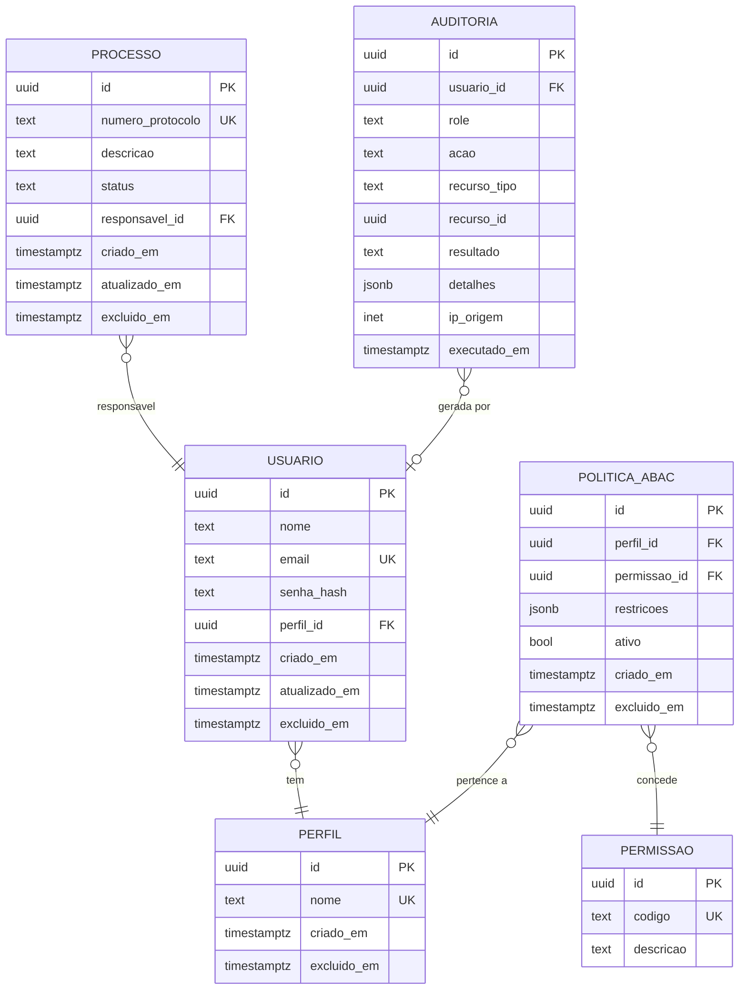
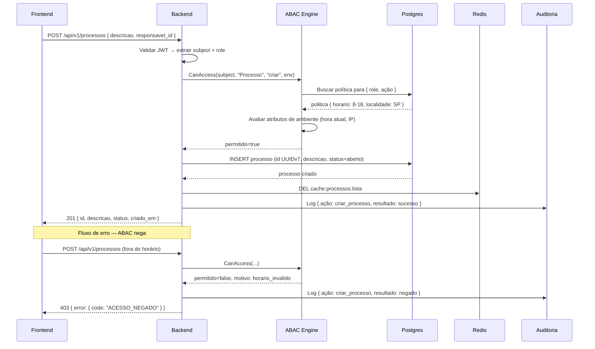
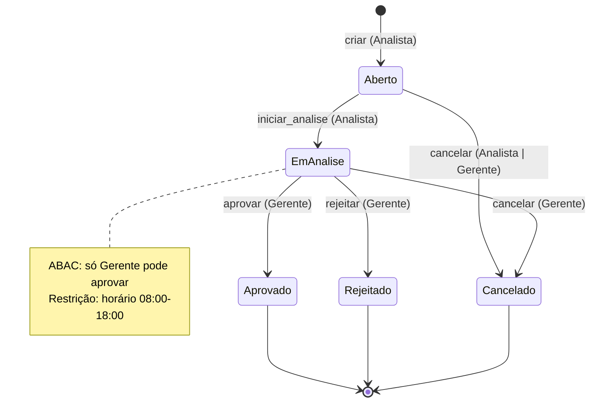
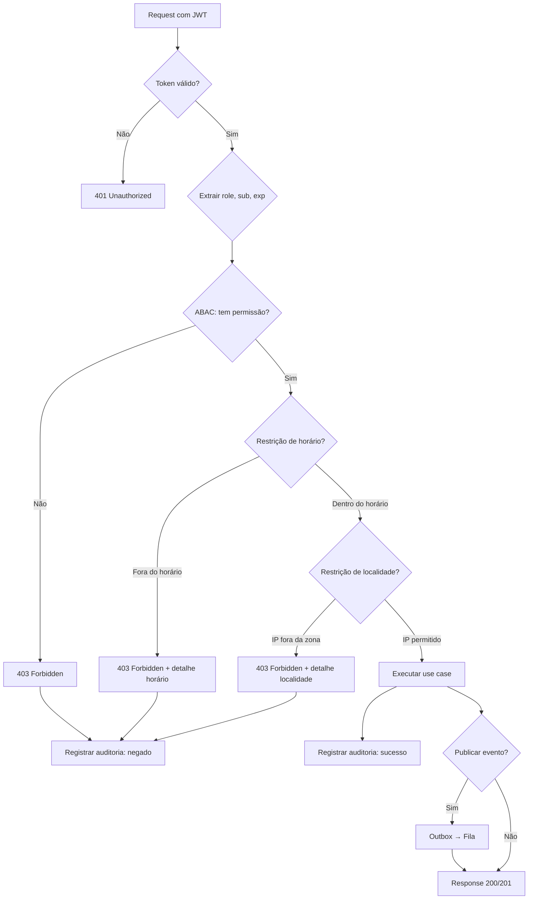
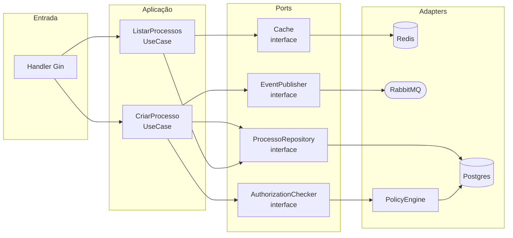

# Exemplos de Diagramas Mermaid

Referência para `arquiteto`, `dba` e `tech-writer`. Todos os exemplos
usam entidades do domínio típico deste projeto. Cole num bloco
` ```mermaid ``` ` nos arquivos `.md` — GitHub, GitLab e VS Code
renderizam nativamente.

---

## 1. erDiagram — Schema do banco

Use para documentar as tabelas criadas/alteradas em `specs/<feature>/diagrama-banco.md`
e o diagrama consolidado em `docs/diagrama-banco.md`.



---

## 2. sequenceDiagram — Fluxo de uma requisição

Use em `design.md` para documentar como as camadas interagem.



---

## 3. stateDiagram-v2 — Máquina de estados

Use para documentar o ciclo de vida de uma entidade ou fluxo de autorização.



---

## 4. flowchart — Fluxo de decisão / arquitetura de componentes

Use para documentar decisões de negócio ou arquitetura de uma feature.



---

## 5. flowchart — Arquitetura hexagonal de uma feature



---

## Dicas de sintaxe Mermaid (erros comuns)

| Situação | Certo | Errado |
|---|---|---|
| Seta em sequence (requisição) | `->>` | `->` |
| Seta em sequence (resposta) | `-->>` | `-->` |
| Node ID com espaço | `A[Meu Node]` | `Meu Node[...]` |
| Relação ER um-para-muitos | `\|\|--o{` | `1--N` |
| Fechar bloco | `end` | (esquecer fecha = parse error) |
| Caracteres especiais em label | `A["texto: especial"]` | `A[texto: especial]` |
| **Ponto e vírgula no texto** | `#59;` (entidade HTML oficial) ou reescrever sem `;` | `;` diretamente no texto — o parser interpreta como fim de linha e quebra o diagrama |

### Ponto e vírgula em labels de sequenceDiagram

O `;` tem papel especial no Mermaid: pode substituir quebra de linha para
definir múltiplas instruções. Por isso **não pode aparecer diretamente**
no texto de uma mensagem ou nota.

**Padrão adotado neste projeto: `Note` para condições e detalhes.**

É a opção mais legível — o label da seta fica curto, as condições ficam
numa nota posicionada logo abaixo, visualmente associada à seta.

```
sequenceDiagram
  FE->>FE: redireciona conforme função
  Note right of FE: aluno → /painel-aluno
  Note right of FE: demais → /app
```

**Tipos de Note disponíveis:**
```
Note right of A: texto          → nota à direita do participante A
Note left of A: texto           → nota à esquerda do participante A
Note over A: texto              → nota sobre o participante A
Note over A,B: texto            → nota cobrindo de A até B
```

**Se o `;` for inevitável:** use `#59;` (entidade HTML oficial).
```
FE->>FE: redireciona (aluno → /painel-aluno#59; demais → /app)
```

**Regra prática:**
- Label da seta: curto e sem `;`
- Condições, rotas, detalhes: `Note` logo abaixo da seta
